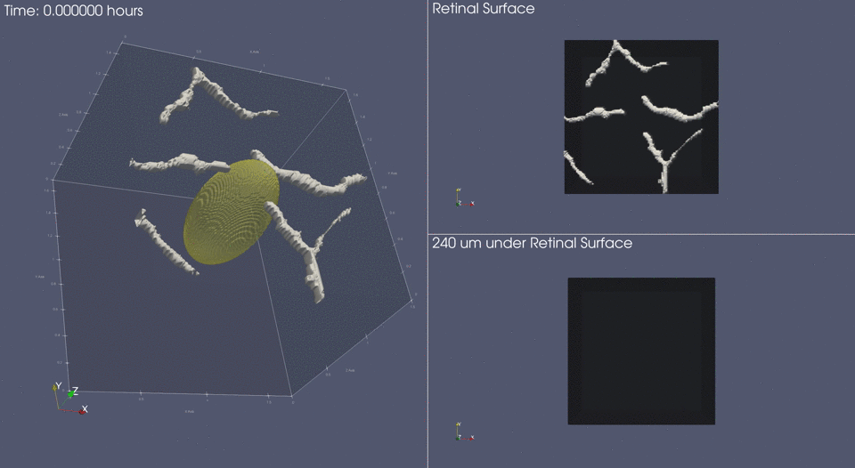

<p align="center">
  
</p>

# Simulating Retinal Hemangioblastoma with FEniCS and Mocafe

**************************************************************************

The materials contained in this folder allow the reproduction of the simulations of RH development
and angiogenesis with FEniCS and Mocafe. 

> :warning: Notice that 3D simulations require a considerable computational effort, so consider using an 
> appropriate machine to reproduce that. For instance, it required about 24 h and about 150 GB of RAM to simulate 
> 300 steps of tumor development and angiogenesis.

## Quick instructions
Modify the `main.py` script according to your needs to run a simulation. To ensure full reproducibility, we recommend 
to use [Singularity](https://github.com/sylabs/singularity):

```shell
# pull container
singularity build mocafe_v1-5-0.sif library://fpradelli94/mocafe/mocafe:1.5.0
# execute main in the container
singularity exec mocafe_v1-5-0.sif python3 main.py
```

We also recommend to run the script in parallel to save time. To do so, you can exploit `mpirun` typing the following:
```shell
# run over 4 cores
singularity exec mocafe_v1-5-0.sif mpirun -n 4 python3 main.py
# run over x cores, according to your system
singularity exec mocafe_v1-5-0.sif mpirun -n x python3 main.py
```

If you don’t have Singularity installed, just follow the instructions provided at the official documentation page for 
[SingularityCE](https://sylabs.io/docs/).

By default, the simulation output will be stored in `saved_sim`. For a detailed explanation of the generated files, 
see section "Simulation output".

## Slurm integration
Our code is compatible with [slurm](https://slurm.schedmd.com/documentation.html). If you use slurm to run
our code, it is recommended to use a `sbatch` script like the following:

```shell
#!/bin/bash
#SBATCH --job-name rh_mocafe

srun singularity exec sif/mocafe_v1-5-0.sif python3 main.py -slurm_job_id $SLURM_JOB_ID
ex=$?
```

## Simulation output
The standard simulation output is a folder with the following structure:
```shell
.
├── 0_reproduce
├── af.h5
├── af.xdmf
├── c.h5
├── c.xdmf
├── grad_af.h5
├── grad_af.xdmf
├── phi.h5
├── phi.xdmf
├── resume
├── sim_info
├── tipcells.h5
└── tipcells.xdmf
```
Where:

- All the `*.xdmf` and `*.h5` files are the actual simulation output. You can load the XMDF files
in ParaView to see the result of the simulation in time.
- The folder `0_reproduce` contain a copy of the script used to generate the simulation. 
It can be used to check exactly which command was used to generate the output and to reproduce the simulation.
- The folder `resume` contains the data to resume the simulatio (e.g. if is necessary to simulate 100 more 
time steps).
- The folder `sim_info` contains:
  - `incremental_tipcells.json`: a json file containing the data of every tip cell at each time step.
  - `mesh_parameters.csv`: a summary of the mesh used for the simulation.
  - `sim_info.html`: a report summary file for the simulation
  - `sim_parameters.csv`: a table with all the parameters value used in the simulation.

## GitHub and Zenodo
This repository is available both on GitHub or on Zenodo. The GitHub version is meant to clone and reproduce the 
results. On the Zenodo repository, you can access some of the generated output of the code, and the simulation 
results that we used in our manuscript. See the section "Repository folders" (below) for additional info.

## Repository folders
This repository contains several folders. In the following, we explain the content of each of those in detail.

```bash
.
├── input_images
├── notebooks
├── saved_sim
├── saved_sim_archive # only on Zenodo
├── sif               # only on Zenodo
├── src
└── visualization
```
### :file_folder: `input_images`
Contains the images, derived from the Optical Coherence Tomography Angiography, used in the program to generate 
the initial condition for the simulation.

### :file_folder: `notebooks`
Contains two Jupyter Notebooks :
- `parameters.ipynb` : Generates the `.csv` table of the simulation's parameters.
- `vessels_image_processing` : process the images contained in `input_images` to generate the binaries used to 
reconstruct the initial capillaries in 3D

The output of the notebooks is in `notebooks/out`. You can generate it running the notebooks, or you can find them on 
Zenodo. 

### :file_folder: `saved_sim`
This folder will contain the simulation files, if you run some simulations.

### :file_folder: `saved_sim_archive`
Contains the results of the simulations shown in the manuscript in Figure 2 and Figure 4. Available only on Zenodo. 

The recommended way to visualize the simulation result is [ParaView](https://www.paraview.org/). If you need help in using ParaView, please refer
to the ParaView documentation or to 
[Mocafe tutorials](https://biocomputingup.github.io/mocafe/build/html/demo_doc/angiogenesis_3d.html#visualize-the-result-with-paraview).

Also, you can consider using the visualization script provided in `visualization` subfolder.

### :file_folder: `sif`
Contains the Mocafe singularity container used to perform the simulations. It is recommended to use the same container
to ensure reproducibility. Available only on Zenodo.

To access the same container, just pull it from the cloud library:

```shell
singularity build sif/mocafe_v1-5-0.sif library://fpradelli94/mocafe/mocafe:1.5.0
```

### :file_folder: `src`
Contains the source code used in the `main.py` script. 

### :file_folder: `visualization`
Contains scripts and data related to visualization. There are two sub-folders: `paraview` and `python`

1. `paraview`

Contains a script, `section.py`, to visualize a simulation in 3D with [ParaView](https://www.paraview.org/). 
It only works with 3D simulations and with ParaView >5.9.0.

To use the script, open ParaView and, on the View tab, select "Python Shell". 
A new window will appear with a botton "Run Script". Press the button and select the file `setion.py`.

If the script runs correctly, it will ask for two inputs: the absolute paths of the simulation's `c.xdmf` file 
and of the `phi.xdmf` file. Copy and paste them in the box that will appear and leave ParaView do the rest.

It might take some minutes to display the result.

2. `python`

Containing the scripts used to produce some plots reported in the manuscript. More precisely, there are:

- `activation_tiles.py`, which generates a tiles plot of the parameters leading to angiognesis (Fig. 3 of the manuscript)
using the table `sim_index.csv`.
- `tipcells_in_time.py`, which generates a plot of the number of tipcells at any simulation step (like in Fig. 4 of the 
manuscript).

## Meta
Franco Pradelli (franco.pradelli94@gmail.com), Giovanni Minervini, and Silvio Tosatto  

## License
This work is licensed under the Creative Commons Attribution-NonCommercial 4.0 International License. 
To view a copy of this license, visit http://creativecommons.org/licenses/by-nc/4.0/ or send a letter to Creative Commons, PO Box 1866, Mountain View, CA 94042, USA.